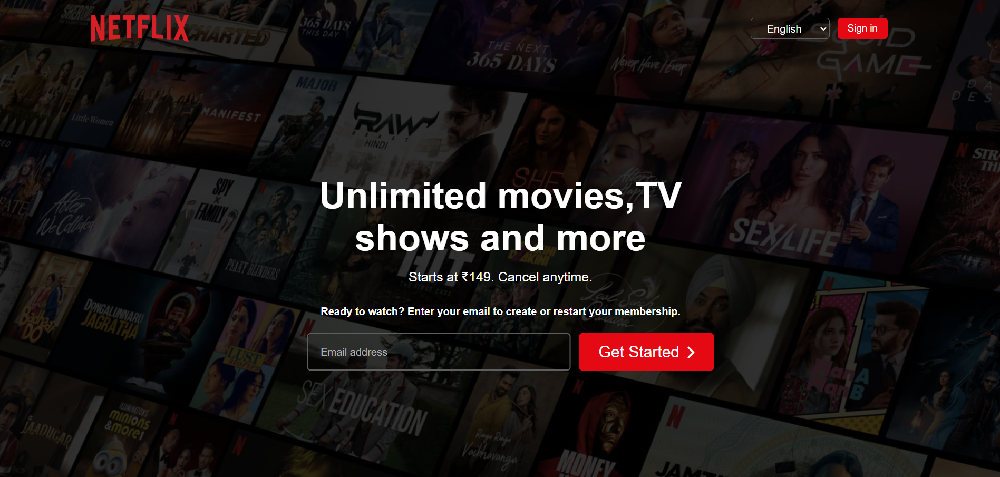

# 🎬 Netflix Website Clone

This project is a **clone of the Netflix website**, created as part of a personal coding challenge. The clone showcases the use of **HTML, CSS, and JavaScript** to mimic the design and functionality of Netflix's user interface.  
**Now fully responsive for all screen sizes** 📱💻.

---

## 📸 Screenshots

### 🏠 Homepage :


---

## 🌐 Live Demo  

The project is live and can be viewed here: [Netflix-Clone](https://clone-website-project.vercel.app/)  

---

## 🚀 Features

- 🖥️ **Header:** Includes Netflix logo, navigation menu, and search bar.
- 🎭 **Hero Section:** A full-screen banner with a background image and a call-to-action button.
- 🎬 **Content Sections:** Multiple sections showcasing various content categories, including movies and TV shows.
- ❓ **FAQ Section with Toggle Functionality:** Expand and collapse FAQs using JavaScript.
- 📱 **Fully Responsive Design:** Optimized for desktops, tablets, and mobile devices.

---

## 🛠️ Technologies Used

- 🖥️ **HTML5** - For structuring the web pages.
- 🎨 **CSS3** - For styling the website and creating responsive layouts.
- ⚡ **JavaScript (Vanilla JS)** - For handling the FAQ toggle functionality.

---

## 📂 Project Structure

```
Netflix-Clone/
│
├── index.html
├── styles.css
├── script.js
├── images/
│   └── image.png
└── README.md
```

---

## 🎯 How to Run the Project

1️⃣ Clone the repository:
```bash
  git clone https://github.com/TonyStark-19/netflix-clone.git
```

2️⃣ Open the project folder:
```bash
  cd netflix-clone
```

3️⃣ Open the `index.html` file in your browser.

---

## 🌟 Acknowledgments

- 🎬 [Netflix](https://www.netflix.com) for design inspiration.

---

