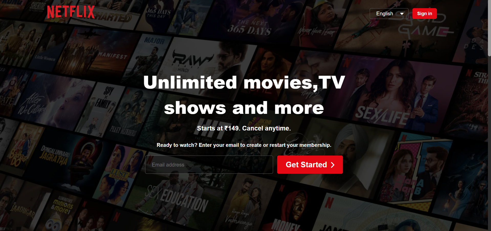
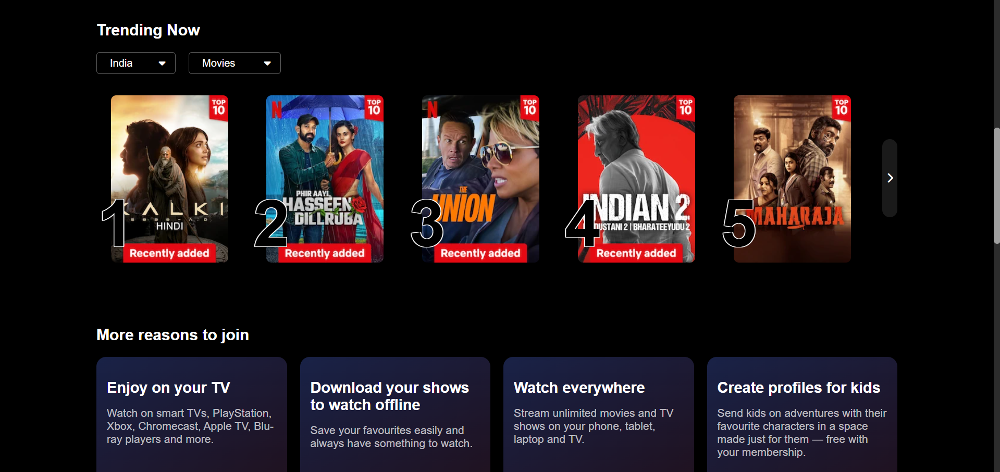
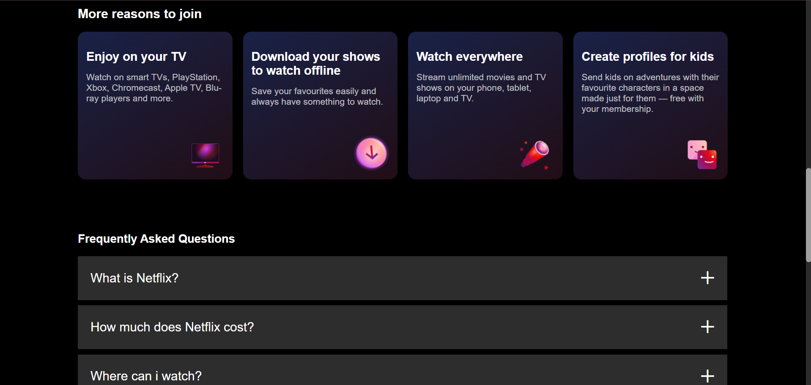
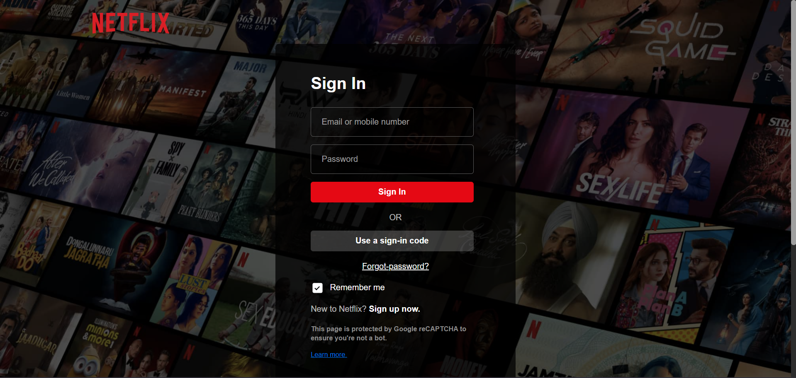

# 🎬 Netflix Website Clone

A **Netflix Website Clone** built using **HTML, CSS, and JavaScript**, showcasing responsive design and interactive UI components.  
This project was created as part of my personal coding challenge to replicate Netflix’s clean and dynamic interface.  
Now **fully responsive** and compatible across all devices 📱💻.

---

## 📸 Screenshots

| Preview 1 | Preview 2 |
|------------|------------|
|  |  |

| Preview 3 | Preview 4 |
|------------|------------|
|  |  |

---

## 🚀 Features

- 🖥️ **Header:** Includes Netflix logo, navigation menu, and a search bar.  
- 🎭 **Hero Section:** A large banner with background image, tagline, and call-to-action button.  
- 🎬 **Content Sections:** Multiple categorized movie and TV show previews.  
- ❓ **FAQ Section:** Expand/collapse functionality powered by JavaScript.  
- 🎨 **Font Awesome Integration:** Icons for navigation and UI enhancement.  
- 📱 **Fully Responsive Design:** Works seamlessly on desktop, tablet, and mobile devices.  

---

## 🛠️ Technologies Used

- **HTML5** → Structuring the content  
- **CSS3** → Styling, animations, and responsive layout  
- **JavaScript (Vanilla JS)** → FAQ toggle interactivity  
- **Font Awesome** → Icons for better visual design  

---

## 🎯 How to Run the Project

1️⃣ Clone the repository:
```bash
  git clone https://github.com/TonyStark-19/netflix-clone.git
```

2️⃣ Open the project folder:
```bash
  cd netflix-clone
```

3️⃣ Open the `index.html` file in your browser.

---

## 🌟 Acknowledgments

- 🎬 [Netflix](https://www.netflix.com) for design inspiration.
- 💡 Inspired by modern web design and responsive development practices.

---

⭐ If you like this project, don’t forget to star the repository!

